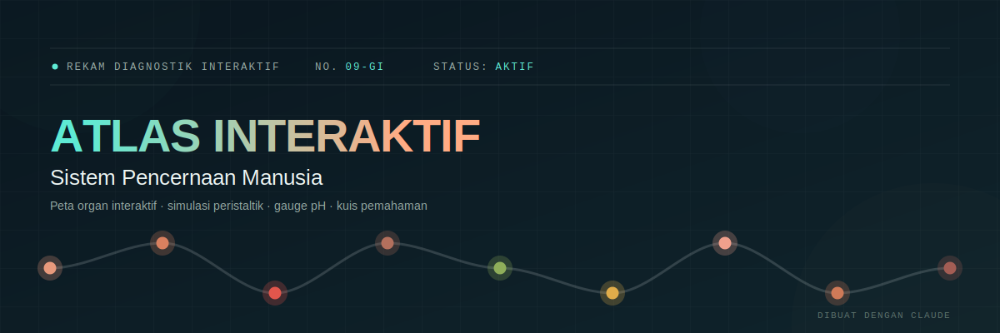

<p align="center">
  
</p>

<h1 align="center">SISTEM PENCERNAAN Interaktif — SISTEM PENCERNAAN Manusia</h1>

<p align="center">
  Peta anatomi yang bisa diklik, simulasi perjalanan makanan dengan gelombang peristaltik hidup,<br/>
  dan materi mendalam — dari enzim, hormon, sampai "otak kedua" di perut sendiri.
</p>

<p align="center">
  
  
  
</p>

---

## Tentang Proyek

**SISTEM PENCERNAAN Interaktif** adalah aplikasi web satu halaman (*single-page*) untuk mempelajari SISTEM PENCERNAAN manusia secara visual dan interaktif. Alih-alih membaca teks datar, pengguna bisa mengklik tiap organ pada diagram anatomi, menjalankan simulasi perjalanan makanan lengkap dengan gelombang peristaltik dan jejak partikel, memantau gauge pH tiap organ secara langsung, membaca materi berlapis dari dasar sampai lanjutan, dan menguji pemahamannya lewat kuis di akhir.

Seluruhnya berjalan dari satu file HTML — tanpa server, tanpa instalasi, tanpa proses build. Tinggal dibuka di browser.

## ✨ Fitur Utama

- **Peta Organ Interaktif** — diagram SVG 9 organ pencernaan yang bisa diklik maupun dinavigasi lewat keyboard, masing-masing membuka kartu diagnostik lengkap dengan gauge pH hidup.
- **Simulasi Perjalanan Makanan** — animasi gelombang peristaltik dan jejak partikel yang mengikuti jalur makanan dari mulut sampai rektum, dengan penanda organ yang sedang aktif.
- **Materi Lengkap — "Sembilan Plat, Satu Perjalanan"** — pembahasan tiap organ secara berurutan (fungsi, pH, enzim), dilengkapi gangguan pencernaan umum per organ dan kebiasaan menjaga kesehatan pencernaan.
- **Lebih Dalam** — lapisan dinding saluran cerna, jalur pencernaan tiga makronutrien, hormon pencernaan, sistem saraf enterik ("otak kedua" dengan 100–500 juta neuron), sistem imun usus / GALT, dan glosarium istilah penting.
- **Fakta & Kuis** — kumpulan fakta menarik seputar SISTEM PENCERNAAN, ditutup dengan 11 soal uji pemahaman dan skor otomatis.
- Desain gelap dengan aksen warna khas tiap organ, tipografi Space Grotesk/Inter/IBM Plex Mono, tampilan responsif, serta menghormati preferensi `prefers-reduced-motion` untuk aksesibilitas.

## 🫀 Sembilan Organ yang Dibahas

| Plat | Organ | Rentang pH |
|:---:|---|:---:|
| 01 | Mulut | 6.5 – 7.4 |
| 02 | Esofagus | 6.0 – 7.0 |
| 03 | Lambung | 1.5 – 3.5 |
| 04 | Hati | 7.1 – 8.5 |
| 05 | Kantong Empedu | 7.1 – 8.5 |
| 06 | Pankreas | 8.0 – 8.3 |
| 07 | Usus Halus | 7.0 – 8.5 |
| 08 | Usus Besar | 5.5 – 7.0 |
| 09 | Rektum & Anus | 6.5 – 7.0 |

## 🚀 Cara Menjalankan

**Lokal** — unduh `index.html`, lalu buka langsung dengan browser apa saja. Tidak perlu server atau dependency tambahan.

**GitHub Pages (demo online)** — aktifkan lewat *Settings → Pages → Deploy from branch* (pilih branch `main`, folder `/root`). Karena proyek ini hanya berisi satu file statis, halaman langsung bisa diakses publik tanpa konfigurasi tambahan.

## 🗂️ Struktur Proyek

```
.
├── index.html    # Aplikasi utama — HTML, CSS, dan JS dalam satu file, tanpa dependency build
├── banner.svg    # Banner proyek
├── README.md
├── LICENSE
└── .gitignore
```

## 🛠️ Teknologi

- HTML5 + CSS3 (custom properties sebagai design tokens, tanpa framework CSS)
- Vanilla JavaScript — tanpa library eksternal
- SVG untuk diagram anatomi interaktif
- Google Fonts: Space Grotesk, Inter, IBM Plex Mono

## 🤖 Dibuat dengan Claude

Kode HTML, CSS, dan JavaScript pada proyek ini — termasuk diagram SVG interaktif, animasi simulasi peristaltik, hingga seluruh materi edukasi di setiap tab — disusun dengan bantuan [Claude](https://claude.ai), model AI dari Anthropic.

Karena kontennya menyentuh topik anatomi dan fisiologi, ada baiknya materi di sini tetap dicek ulang dengan sumber medis/biologi yang tepercaya sebelum dipakai untuk keperluan belajar formal seperti tugas sekolah atau bahan ajar resmi.

## 📄 Lisensi

Proyek ini dirilis di bawah [Lisensi MIT](LICENSE) — bebas dipakai, dimodifikasi, dan disebarluaskan, termasuk untuk keperluan komersial, selama mencantumkan atribusi.
